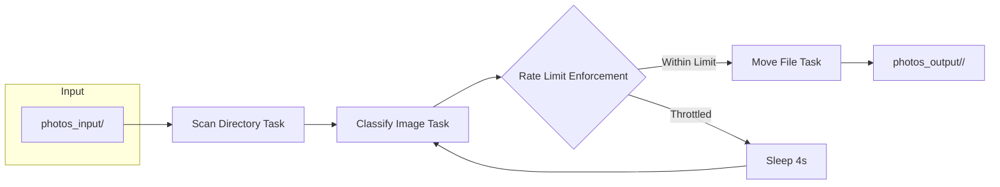

# Gemini Photo Sorter

## Overview

**Gemini Photo Sorter** is a Prefect-based pipeline that:

1. **Scans** an input directory for image files.
2. **Classifies** each image using the Google Gemini Vision API.  
3. **Moves** the file into a subfolder named after its classification.

It enforces Google’s rate limits (≤15 requests/minute) by processing images sequentially with a built‑in delay.

## Design & Development Process

### 1. Initial Prototype
- **Tasks** implemented in `src/tasks.py`:  
  - `scan_directory` to list image files.  
  - `classify_image_with_gemini` to call Gemini Vision and parse the result.  
  - `move_file` to relocate images into classification folders.
- **Flow** in `src/flow.py` used Prefect’s `.map()` for parallelism.

### 2. Quota & Concurrency Challenges
- Hitting Gemini’s **15 requests/minute** free‑tier quota caused 429 errors.
- Prefect 3.x’s task runner API changed, and adding concurrency limits via `max_concurrency` or `SequentialTaskRunner` imports failed.

### 3. Final Solution
- **Sequential Processing**: Switched to a plain Python `for` loop, invoking classification one‐by‐one.
- **Built‑in Delay**: Kept a `time.sleep(4)` inside the classification task to space calls at roughly 15/minute.
- **Simplify Folder Names**: Normalized classification output (lowercase, underscores, no punctuation) to avoid duplicate dirs like `soup` vs `soup.`.
- **Removed `.map()` and `.result()`**: In Prefect 3, tasks return real objects; looping makes debugging and rate‑limiting straightforward.

## Project Structure

```
gemini_photo_sorter/
├─ docker-compose.yml         # Service definitions
├─ .env                       # GOOGLE_API_KEY=<your_key>
├─ src/
│  ├─ flow.py                 # Prefect flow (sequential)
│  └─ tasks.py                # Prefect tasks (scan, classify, move)
└─ photos_input/              # Put your images here
   photos_output/             # Classification folders appear here
```

## Prerequisites

- Docker & Docker Compose
- A Google Cloud API key with Gemini Vision enabled
- Prefect 3.x installed (comes via image)

## Setup & Running

1. **Add your key** to a top‑level `.env`:
   ```env
   GOOGLE_API_KEY=your_api_key_here
   ```

2. **Build & start** the container:
   ```bash
   docker-compose up --build -d
   ```

3. **Run** the sorting flow:
   ```bash
   docker-compose exec app prefect deployment run "Image Classification and Sorting Flow/sort-images"
   ```

   Or, to run locally without Docker:
   ```bash
   cd src
   python flow.py
   ```

4. **Check** `photos_output/` for subfolders named after classifications.

## Troubleshooting

## Tech Stack
- **Python 3.11**: Core scripting language, chosen for its modern features and Prefect compatibility.
- **Prefect 3.x**: Orchestration framework that provides an elegant API for defining tasks and flows, and makes sequential execution straightforward.
- **Docker & Docker Compose**: Ensures consistent runtime environments and simplifies deployment and testing.
- **Google Gemini Vision API**: Provides powerful, pre-trained image classification; rate-limiting was a core design consideration.
- **Pillow (PIL)**: Lightweight library for image validation and basic processing.
- **python-dotenv**: Securely loads environment variables from a `.env` file.
- **Pathlib & Shutil**: Standard library modules for filesystem operations (scanning directories, moving files).

## Tech Stack Diagram

```mermaid
flowchart LR
  A[Python 3.11] --> B[Prefect 3.x]
  A --> C[Pillow]
  A --> D[python-dotenv]
  B --> E[Docker & Docker Compose]
  E --> F[Sequential Flow Execution]
  B --> G[Google Gemini Vision API]
  G --> C
  C --> H[Filesystem (Pathlib & Shutil)]
  F --> H
```

**ASCII Diagram:**
```
+-------------+      +-------------+      +---------------------------+
| Python 3.11 |----->| Prefect 3.x |----->| Google Gemini Vision API   |
+-------------+      +-------------+      +---------------------------+
      |                    |                            |
      v                    v                            v
+----------+         +--------------+            +-------------+
| Pillow   |         | python-      |            | Docker &    |
| (PIL)    |         | dotenv       |            | Compose     |
+----------+         +--------------+            +-------------+
      \                    |                            |
       \                   v                            v
        +--------------+   +---------------------------+   +------------------+
        | Sequential  |-->| Filesystem (Pathlib &     |   | Classification    |
        | Execution   |   | Shutil)                   |   | & Moving Files    |
        +--------------+   +---------------------------+   +------------------+
```

- **Python 3.11**: Core scripting language, chosen for its modern features and Prefect compatibility.
- **Prefect 3.x**: Orchestration framework that provides an elegant API for defining tasks and flows, and makes sequential execution straightforward.
- **Docker & Docker Compose**: Ensures consistent runtime environments and simplifies deployment and testing.
- **Google Gemini Vision API**: Provides powerful, pre-trained image classification; rate-limiting was a core design consideration.
- **Pillow (PIL)**: Lightweight library for image validation and basic processing.
- **python-dotenv**: Securely loads environment variables from a `.env` file.
- **Pathlib & Shutil**: Standard library modules for filesystem operations (scanning directories, moving files).


- **429 Quota Errors**: Ensure sequential mode is active; confirm your key is valid and `.env` loaded.
- **Duplicate Folder Names**: The classification task now strips punctuation—deleted any stray `soup.` folder once.
- **Prefect Import Errors**: This flow avoids Prefect’s advanced runners; it works on Prefect 3.3+ without extra imports.

---

## Architecture Diagram



**ASCII Diagram (renders in any text editor):**
```
 +---------------+    +--------------------------+
 | photos_input/ | -> | Scan Directory Task      |
 +---------------+    +--------------------------+
                          |
                          v
                    +--------------------------+
                    | Classify Image Task      |
                    +--------------------------+
                          |
                          v
                    +--------------------------+
                    | Rate Limit Enforcement   |
                    +--------------------------+
                     /            \
          Within Limit            Throttled
                     \              /
                      v            v
                +----------------+  +----------------+
                | Move File Task |  | Sleep 4s       |
                +----------------+  +----------------+
                      |                 |
                      v                 |
           +---------------------------+|
           | photos_output/<classification>/|
           +---------------------------+
 ```

> To actually view the Mermaid diagram, paste the block into a Mermaid live editor (e.g. [mermaid.live](https://mermaid.live)). GitHub READMEs also render Mermaid diagrams natively.

> Designed by Sean N. • April 2025

